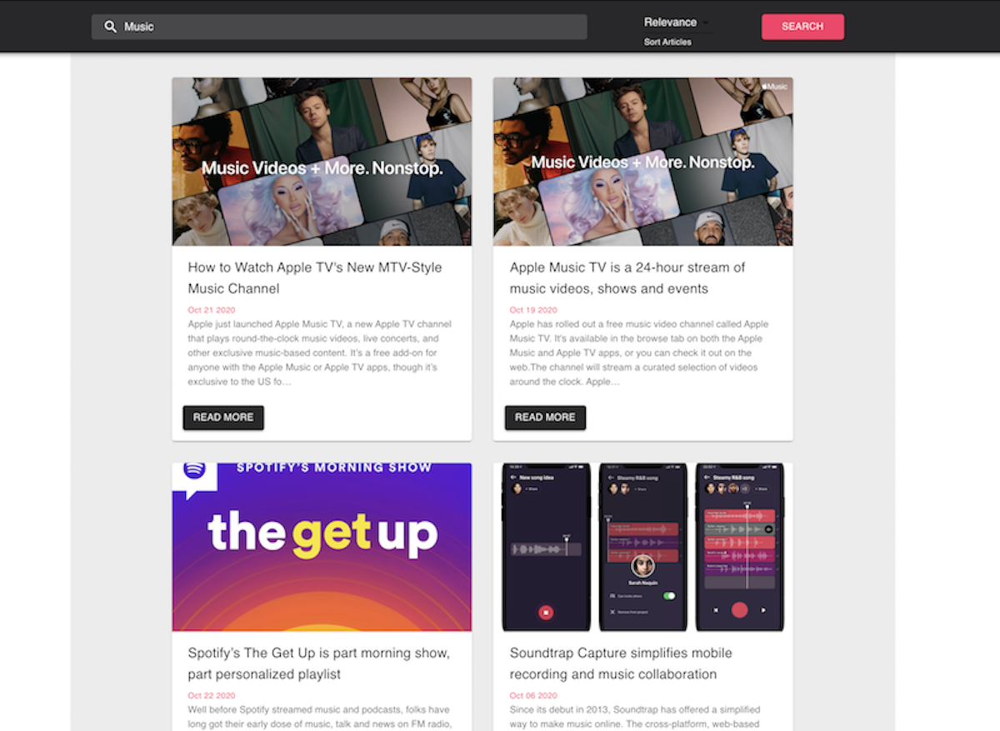

## news-app .  Dia&Co. Engineering Team Homework
 A news search app using [NewsAPI](https://newsapi.org)! The goal is to create a static application with HTML5, CSS3 and Javascript. 

 ## Features
  This application lets the user:
  - Search for articles (in language 'en') by a search string 
  - The homepage of the app is simply a search bar and a welcome message
  - Search results show the image, title, publish date, description and the url (as 'Read More' button) of the articles
  - Clicking the image or the 'Read More' button will open the article in a new tab 
  - If  there is no image returned by the api, it displays a placeholder image
  - The app is mobile responsive! 
     - For smaller screen sizes,
        -  it shows articles in a single column 
        -  it hide the article description
     - For screen medium and large screens
        -  it shows articles in a two column   
  - Here is the screenshot of the app
   

# Implementation
This project was bootstrapped with [Create React App](https://github.com/facebook/create-react-app).\
 [Material-ui](https://material-ui.com/) theme and CSS are used to create styled React components.\
 Jest is used to test the project.

# Runing the Project

In the project directory, you can install the dependencies by running

### `yarn install`

you can run the app by running:

### `yarn start`

Runs the app in the development mode.\
Open [http://localhost:3000](http://localhost:3000) to view it in the browser

### `yarn test`

Launches the test runner in the interactive watch mode.

## How I might improve the project
I decided to implement the design and features as requested in the assignment.
These are the things that I might do to improve on this project

- Add more test cases  for example one to test that the correct search results show when the search term or the article sorting options are changed.

- Make the web app progressive by caching assets in the local storage.

- The design for smaller screens can be improved for better user experince, I might bring the selection box for sorting articles right below the AppBar and see if that makes the user experience better. This will involvendiscussion with thee design team.

- There is an option to add infinite scroling or pagination to the page.

- I would improve the assesibility of the application, like the contrast ratio of the  curent design can be improved.